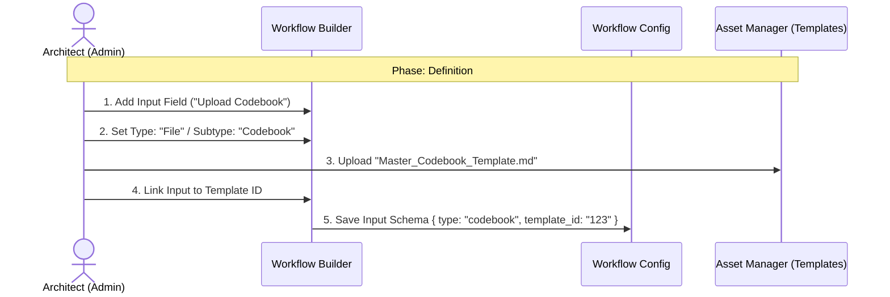
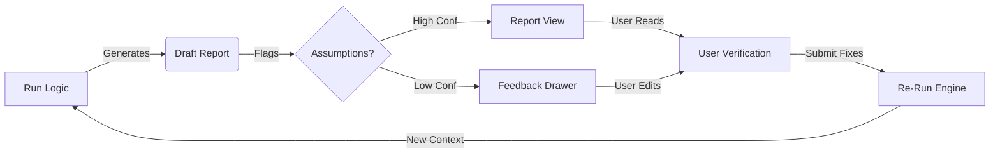

# UX Design Specification - project_bubble

> [!NOTE]
> This document outlines the UX patterns, visual style, and interface components for project_bubble. It serves as the bridge between requirements (PRD/Epics) and implementation.

## Executive Summary

### Project Vision
**"The Transparent Engine."**
A professional, "Glass Box" platform for executing generic LangGraph workflows. It prioritizes **Traceability** (citations), **Control** (human-in-the-loop), and **Schema-Driven Flexibility** over "magic."

### Target Users
*   **The "Under-Pressure PMM" & "RevOps Leader":** Mid-market SaaS. Needs to defend insights to the Board. Values accuracy (`Verify`) over chatty automation.
*   **The "Admin Creator":** Configures workflows. Needs a strict, safe environment where "What You Deploy Is What You Get."

### Key Design Challenges & Mitigations
1.  **Generic vs Specific:** The UI must render *any* workflow schema (Input Block) without feeling like a raw database form.
    *   *Mitigation:* **Accordions by Default** for complex optional schemas.
2.  **Creation-Time Experience:** Preventing broken workflows before they reach the user.
    *   *Mitigation:* **Strict Deployment Gate** (No "Raw Mode"). If the UI widget doesn't exist, the workflow cannot be published.
3.  **Validation Deadlocks:**
    *   *Mitigation:* **Server-Side Pre-Flight** to sync validation logic in real-time.

## 1. Design Principles & Aesthetic
**Core Philosophy: "The Transparent Engine"**
*   **Platform-First:** The UI is a generic player for *any* LangGraph workflow. It adapts to the schema, not a hardcoded use case.
*   **Traceable Truth:** Every output must reference its source (Citations/Trace).
*   **Professional Precision:** Dark/Blue aesthetic (from `screenshot_navbar.jpg`), high-density data, low visual noise.

## 1.1 Architecture Decision Record (ADR 1): UI Rendering Strategy
*   **Decision:** **Hybrid Schema-Driven (Option 2).**
*   **Why:** Solves the "Tax Return" vs. "Broken Workflow" dilemma.
*   **Implementation:**
    *   **The Skeleton (Logic):** The UI reads a rigid JSON Schema to know *what* data is needed.
    *   **The Skin (Visuals):** We do not use default browser inputs. We use **Custom Angular Components** mapped to schema types.
        *   `type: file` -> Renders `<app-file-dropzone>` (Animated, drag-and-drop).
        *   `type: selection` -> Renders `<app-rich-card-select>` (Visual cards, not a dropdown).
*   **Safety (The Strict Gate):** The Admin Panel uses a **Validator** that checks: *"Does the Frontend have a registered component for this Widget Type?"*
    *   If **No** -> The Workflow **cannot be published**.
    *   This guarantees a user never sees a "Raw JSON input" or broken form.

## 1.2 Rejected UX Patterns (SCAMPER Analysis)
*   **Conversational UI (Chat-to-Start):** Rejected. Adds friction for pro users who know what they want.
*   **Drag-to-Start:** Rejected. Inconsistent behavior across complex workflows.
*   **Draft Mode:** Rejected. High technical cost (DB/State) for low MVP value.
*   **Verdict:** Stick to the **Clean Modal**. Predictability > Novelty.

*   **Verdict:** Stick to the **Clean Modal**. Predictability > Novelty.

## 1.3 Personal Focus Group (Method 5): The Creator Persona
*   **Insight:** Creators (Workflow Builders) have a strong **Debug Focus**.
    *   *Problem:* When a run fails, they need to see "exactly what the LLM saw" to iterate on the prompt.
    *   *Mitigation:* **The Simulation/Trace View.**
    *   **Design Implication:** The "Run Details" page must support two distinct viewing modes:
        1.  **Consumer View:** Clean, polished Report (The "What").
        2.  **Creator View:** Raw Execution Logs, Input/Output per step, Token Usage, and Latency (The "How").

## 1.4 Mockup Analysis Decisions
*   **Status:** The HTML Mockups (`docs/ui_mockup`) are treated as **Inspiration Only**, not a strict blueprint.
*   **Gap Identified:** No designs exist for the **Workshop/Admin** area. We will design this from scratch.
*   **Scope Decision:** "Context Chat" (shown in `report.html`) is **Deferred** to post-MVP (Epic 8).

## 1.5 Mockup Improvement Decisions (Team Proposal Review)
*   **Storefront (Rejected complexity):**
    *   **Outcome Lanes:** Rejected. Keep a simple, flexible grid. Don't enforce artificial groupings.
    *   **Dynamic Previews:** Rejected. Stick to clear "Goal & Outcome" text.
    *   **Resume/Retry:** Rejected. Workflows run to completion. Retries happen via Report Feedback (see below).
*   **Dashboard (Approved):**
    *   **Real-Time Progress:** **Critical/Mandatory.** User must see "Step 3/5" live updates (WebSocket).
*   **Validation (Clarified):**
    *   **Concept:** "Validation" occurs *after* a run generates "Assumptions" (or low-confidence flags).
    *   **Strategy:** **In-Report Feedback (Devon Corrected).**
    *   Inline Dashboard validation is **Rejected**. User must open the Report to see the *impact* of assumptions before fixing them.
    *   **Flow:** Run -> Draft Report (with flags) -> User Opens Report -> Reads -> Opens Feedback Drawer -> Fixes Flags + Adds New Feedback -> Re-Run.
*   **Workshop (Scope Correction):**
    *   **Visual Style:** **Simple Form-Based List (Story 3.1).**
    *   **Aria's "Visual Canvas" (Zapier-style) is REJECTED for MVP.** It defines Epic 10 (Future) code. We must stick to the "Wizard/Form" approach to ship on time.

## 2. Interaction Patterns (Schema-Driven)
**Dynamic Execution Flow:**
1.  **Schema Fetch:** UI loads input definition (JSON Schema) from the selected workflow.
2.  **Form Rendering:**
    *   `type: file` -> Drag & Drop Zone (supports multi-file).
    *   `type: text` -> Text Area or Rich Editor.
    *   `type: boolean` -> Toggle Switch.
    *   *Unknown Type* -> Fallback to Raw Text/JSON input (Graceful Degradation).
3.  **Creation-Time Safety:** Workflow Builder validates schema integrity to prevent runtime errors.
4.  **Run & Observe:** Modal shows real-time step execution (not just a spinner).

## 3. Site Map & Navigation

### 3.1 Zoning Strategy
We divide the application into three distinct zones based on User Persona and Security Context.

| Zone | Persona | Aesthetic | Route Prefix | Access |
| :--- | :--- | :--- | :--- | :--- |
| **Zone A: Public** | Guest | Clean, Minimal | `/auth`, `/shared` | Open / Magic Link |
| **Zone B: App** | Creator / Consumer | Polished, "Storefront" | `/app` | **Authenticated Users** |
| **Zone C: Workshop** | Admin / Architect | Dense, Technical | `/admin` | **Admins Only** |

### 3.2 Site Map

#### **Zone A: Public (Entry)**
*   `/auth/login` - Standard Login.
*   `/auth/set-password` - Invite acceptance.
*   `/shared/report/:token` - **Magic Link Report View**.
    *   *Features:* Read-Only Report, Evidence Drawer.

#### **Zone B: App (The Storefront)**
*Accessible to all Users (Creators & Admins).*
*   `/app/library` - **Workflow Storefront** (Home).
    *   Grid of available Workflows. "Run" triggers Modal.
*   `/app/projects` - **Projects & Runs**.
    *   List of active/past runs.
    *   Route: `/app/run/:id` -> **Live Progress / Creator Trace**.
*   `/app/vault` - **Data Vault** (Asset Management).
    *   **Manage Files:** Upload Codebooks, PDFs, Transcripts.
    *   **Organize:** Folders and Tags.
*   `/app/reports` - **Report Archive**.
    *   Route: `/app/report/:id` -> **Interactive Report**.
    *   **Validation:** Action Drawer for "Human-in-the-Loop".

#### **Zone C: Workshop (The Admin)**
*Restricted to Tenant Admins & Bubble Admins.*
*   `/admin/dashboard` - **Operations**.
    *   Usage Stats, Tenant Settings (if Customer Admin).
*   `/admin/users` - **User Management**.
    *   Invite/Manage Team.
*   `/admin/workflows` - **Workflow Studio**.
    *   Route: `/admin/workflows/:id/edit` -> **The Form-Based Wizard**.
    *   Route: `/admin/workflows/:id/edit` -> **The Form-Based Wizard**.
    *   Defining the "Engine" (Schema, Nodes, Prompts).

### 3.3 Data Governance (The 3-Layer Defense)
To ensure agents receive structured data, we enforce a **Three-Layer Validation Strategy**:

**Layer 1: The Bouncer (Vault Upload)**
*   **Enforcement:** File Extension & Safety (UI Level).
*   **Rules:** Allow `PDF, TXT, MD, DOCX`. Reject `EXE, ZIP`. Max 10MB.
*   **Templates:** Available **ONLY** for Structured Assets (e.g., Codebooks). Not used for raw Transcripts.

**Layer 2: The Keymaster (Workflow Consumption)**
*   **Enforcement:** Input Schema Filters (UI Level).
*   **Rules:** If a Workflow requests a "Codebook", the Asset Picker **ONLY** shows files tagged as `type:codebook`.
*   **Effect:** Prevents using a Transcript where a Codebook is expected.

**Layer 3: The Gatekeeper (Workflow Node 1)**
*   **Enforcement:** Semantic Validity (AI Level).
*   **Mechanism:** The first node of the workflow (The Scanner) reads the first 1k tokens.
*   **Logic:** "Is this actually a transcript?" If NO -> **Fail Fast** with a clear error: *"Input rejected: File appears to be a shopping list."*
*   **Why:** The UI cannot judge meaning; only the Agent can.

## 4. Core User Flows
These flows visualize exactly **When** and **Where** templates are defined and used.

### 4.1 Flow: The Architect (Defining the Inputs)
*   **Where:** `/admin/workflows/:id/edit` (Tab 2: Input Schema).
*   **Action:** The Admin explicitly links a "File Input" to a "Reference Template".

### 4.2 Flow: The Creator (The "Safe" Run)
*   **Where:** `/app/library` -> Run Modal.
*   **Action:** User sees the requirement, downloads the specific template, fills it, and uploads it.

```mermaid
sequenceDiagram
    actor User as Creator
    participant Modal as Run Modal
    participant Vault as Data Vault
    participant Engine as Workflow Engine

    User->>Modal: 1. Click "Run QDA Workflow"
    Modal-->>User: 2. Render Form (See "Codebook" required)
    
    rect rgb(20, 20, 30)
        Note right of User: Garbage Prevention Layer
        User->>Modal: 3. Click "Download Template" (fetches Master_Codebook.md)
        User->>User: 4. Edit/Fill Template locally
        User->>Vault: 5. Upload "My_Project_Codebook.md"
    end

    User->>Modal: 6. Select "My_Project_Codebook.md"
    Modal->>Engine: 7. Submit Run (Validated)
```

### 4.3 Flow: The Feedback Loop (Traceable Truth)
*   **Where:** `/app/report/:id`
*   **Action:** User verifies AI work.

## 5. UI Component Dictionary
*To be defined in discovery phase*

## 6. Feedback & Observation Notes (User Research)
**Initial Input:**
- User provided HTML Mockups in `docs/ui_mockup/` covering Customer/User persona.
- **Preferred Aesthetic:** Dark/Blue theme from `screenshot_navbar.jpg`.
- **Existing Mockups:** `index.html` (Landing?), `report.html` (Report View), `library.html` (Asset View).
