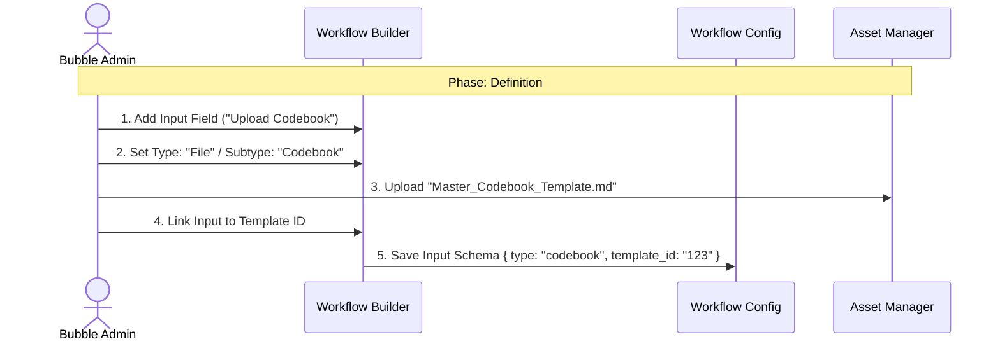
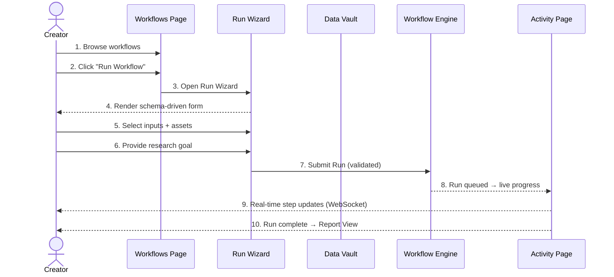
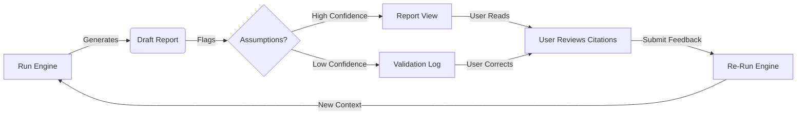

# UX Design Specification - project_bubble

> [!NOTE]
> This document defines the UX patterns, visual style, navigation architecture, page layouts, and UI components for project_bubble. It serves as the bridge between requirements (PRD/Epics) and implementation. All design decisions are grounded in the PRD functional requirements and validated against the HTML mockups and screenshot reference.

---

## Executive Summary

### Project Vision
**"The Transparent Engine."**
A professional, "Glass Box" platform for executing generic LangGraph workflows. It prioritizes **Traceability** (citations), **Control** (human-in-the-loop), and **Schema-Driven Flexibility** over "magic."

### Target Users
* **Creator (Customer User):** PMMs and RevOps leaders at mid-market SaaS. Needs to defend insights to the Board. Values accuracy over chatty automation. Browses workflows, runs them, views reports.
* **Customer Admin:** Everything a Creator does, plus manages their tenant's users, billing, and asset policies.
* **Bubble Admin (Architect):** Internal team. Creates and publishes workflows, manages all tenants, configures LLM providers and system operations. Works in a separate admin portal.
* **Guest:** Read-only access to a specific report via secure magic link. No login required.

### Key Design Challenges & Mitigations
1. **Generic vs Specific:** The UI must render *any* workflow schema (Input Block) without feeling like a raw database form.
   * *Mitigation:* **Accordions by Default** for complex optional schemas. Custom Angular components mapped to schema types.
2. **Creation-Time Experience:** Preventing broken workflows before they reach the user.
   * *Mitigation:* **Strict Deployment Gate** (No "Raw Mode"). If the UI widget doesn't exist, the workflow cannot be published.
3. **Validation Deadlocks:**
   * *Mitigation:* **Server-Side Pre-Flight** to sync validation logic in real-time.

---

## 1. Design Principles & Aesthetic

### 1.1 Core Philosophy: "The Transparent Engine"
* **Platform-First:** The UI is a generic player for *any* LangGraph workflow. It adapts to the schema, not a hardcoded use case.
* **Traceable Truth:** Every output must reference its source (Citations/Trace).
* **Professional Precision:** Dark sidebar with light content area. High-density data, low visual noise. Confidence-inspiring for enterprise users.
* **Density over Decoration:** Status pages (Activity) prioritize data density. Discovery pages (Workflows) allow breathing room.

### 1.2 Architecture Decision Record (ADR 1): UI Rendering Strategy
* **Decision:** **Hybrid Schema-Driven (Option 2).**
* **Why:** Solves the "Tax Return" vs. "Broken Workflow" dilemma.
* **Implementation:**
  * **The Skeleton (Logic):** The UI reads a rigid JSON Schema to know *what* data is needed.
  * **The Skin (Visuals):** Custom Angular Components mapped to schema types:
    * `type: file` → `<app-file-dropzone>` (Animated, drag-and-drop)
    * `type: selection` → `<app-rich-card-select>` (Visual cards, not a dropdown)
    * `type: text` → Text Area or Rich Editor
    * `type: boolean` → Toggle Switch
    * *Unknown Type* → Fallback to Raw Text/JSON input (Graceful Degradation)
  * **Safety (The Strict Gate):** The Admin Panel uses a Validator that checks: "Does the Frontend have a registered component for this Widget Type?" If **No** → The Workflow **cannot be published**.

### 1.3 Rejected UX Patterns (SCAMPER Analysis)
* **Conversational UI (Chat-to-Start):** Rejected. Adds friction for pro users who know what they want.
* **Drag-to-Start:** Rejected. Inconsistent behavior across complex workflows.
* **Draft Mode:** Rejected. High technical cost (DB/State) for low MVP value.
* **Context Chat in Report:** Deferred to post-MVP (Epic 8). Not part of Prototype scope.
* **HubSpot/CRM Sync Panel:** Deferred to Phase 2. Not part of Prototype scope.
* **Visual Canvas Workflow Builder (Zapier-style):** Rejected for MVP. Stick to Form-Based Wizard.
* **Outcome Lanes in Storefront:** Rejected. Keep a simple, flexible grid.
* **Inline Dashboard Validation:** Rejected. User must open the Report to see impact before fixing.
* **Verdict:** Stick to the **Clean Modal**. Predictability > Novelty.

### 1.4 Mockup Status
* **Source:** HTML Mockups in `docs/ui_mockup/` treated as **Inspiration**, not strict blueprint.
* **Screenshot Reference:** `screenshot_navbar.jpg` defines the dark sidebar aesthetic (authoritative).
* **Coverage:** Mockups exist for Workflows (library.html), Activity (project.html), Report (report.html), Run Wizard (modal).
* **Gaps:** No mockups for Data Vault, Settings, Live Progress, or Admin Portal. Designed from principles in this spec.

---

## 2. Design System

### 2.1 Color Palette

#### Brand Colors
| Token | Value | Usage |
|:---|:---|:---|
| `--brand-blue` | `#5654fc` | Primary brand color, CTAs, active states |
| `--brand-pink` | `#ffdddb` | Accent, hover highlights, logo background |
| `--brand-red` | `#fe282a` | Logo only, brand marketing accents |

#### Primary Scale (Indigo)
| Token | Value |
|:---|:---|
| `--primary-50` | `#eef2ff` |
| `--primary-100` | `#e0e7ff` |
| `--primary-200` | `#c7d2fe` |
| `--primary-300` | `#a5b4fc` |
| `--primary-400` | `#818cf8` |
| `--primary-500` | `#5654fc` |
| `--primary-600` | `#4f46e5` |
| `--primary-700` | `#4338ca` |
| `--primary-800` | `#3730a3` |
| `--primary-900` | `#312e81` |

#### Neutrals (Slate)
| Token | Value |
|:---|:---|
| `--slate-25` | `#fcfcfd` |
| `--slate-50` | `#f8fafc` |
| `--slate-100` | `#f1f5f9` |
| `--slate-200` | `#e2e8f0` |
| `--slate-300` | `#cbd5e1` |
| `--slate-400` | `#94a3b8` |
| `--slate-500` | `#64748b` |
| `--slate-600` | `#475569` |
| `--slate-700` | `#334155` |
| `--slate-800` | `#1e293b` |
| `--slate-900` | `#0f172a` |

#### Semantic Colors
| Token | Value | Usage |
|:---|:---|:---|
| `--success` | `#10b981` | Completed states, positive feedback |
| `--success-bg` | `#ecfdf5` | Success background |
| `--success-text` | `#047857` | Success text |
| `--warning` | `#f59e0b` | Queued, needs review, assumptions |
| `--warning-bg` | `#fffbeb` | Warning background |
| `--warning-text` | `#b45309` | Warning text |
| `--danger` | `#dc2626` | Error states, destructive actions |
| `--danger-bg` | `#fef2f2` | Error background |
| `--danger-text` | `#b91c1c` | Error text |

> **Design Decision:** `--brand-red` (#fe282a) is reserved exclusively for the logo and brand marketing. `--danger` (#dc2626) is a distinct, darker red used for error/destructive UI states. This prevents ambiguity between brand elements and error indicators.

#### Dark Sidebar Palette
| Token | Value | Usage |
|:---|:---|:---|
| `--sidebar-bg` | `#1e293b` | Sidebar background (slate-800) |
| `--sidebar-text` | `#e2e8f0` | Primary sidebar text |
| `--sidebar-text-muted` | `#94a3b8` | Inactive nav labels, secondary info |
| `--sidebar-active-bg` | `#312e81` | Active nav item background (primary-900) |
| `--sidebar-active-text` | `#ffffff` | Active nav item text |
| `--sidebar-hover-bg` | `rgba(255,255,255,0.06)` | Nav item hover state |
| `--sidebar-divider` | `rgba(255,255,255,0.08)` | Subtle separators |

#### Surface & Base
| Token | Value | Usage |
|:---|:---|:---|
| `--bg-app` | `#f8fafc` | Main content background (slate-50) |
| `--bg-surface` | `#ffffff` | Cards, panels, modals |
| `--border-color` | `#e2e8f0` | Default borders (slate-200) |
| `--border-hover` | `#cbd5e1` | Hover borders (slate-300) |
| `--text-main` | `#0f172a` | Primary text (slate-900) |
| `--text-secondary` | `#64748b` | Secondary text (slate-500) |
| `--text-tertiary` | `#94a3b8` | Muted text (slate-400) |

### 2.2 Typography
| Role | Font | Weight | Size |
|:---|:---|:---|:---|
| Display / Headings | Plus Jakarta Sans | 700-800 | 18-32px |
| Body / UI | Inter | 400-600 | 13-16px |
| Labels / Meta | Inter | 500-600 | 11-13px |
| Code / Mono | System monospace | 400 | 13px |

### 2.3 Shadows
| Token | Value | Usage |
|:---|:---|:---|
| `--shadow-xs` | `0px 1px 2px rgba(15,23,42,0.05)` | Subtle elevation |
| `--shadow-sm` | `0px 1px 3px rgba(15,23,42,0.08), 0px 1px 2px rgba(15,23,42,0.04)` | Cards at rest |
| `--shadow-md` | `0px 4px 8px -2px rgba(15,23,42,0.08), 0px 2px 4px -2px rgba(15,23,42,0.04)` | Elevated cards |
| `--shadow-lg` | `0px 12px 24px -6px rgba(15,23,42,0.12), 0px 6px 10px -4px rgba(15,23,42,0.04)` | Dropdowns, popovers |
| `--shadow-xl` | `0px 24px 48px -12px rgba(15,23,42,0.18)` | Modals |
| `--shadow-glow` | `0px 0px 40px -10px rgba(86,84,252,0.4)` | Brand accent glow |

### 2.4 Border Radius
| Token | Value | Usage |
|:---|:---|:---|
| `--radius-sm` | `6px` | Small elements (badges, inputs) |
| `--radius-md` | `8px` | Buttons, form fields |
| `--radius-lg` | `12px` | Cards, panels |
| `--radius-xl` | `16px` | Large cards, sections |
| `--radius-2xl` | `24px` | Modals |
| `--radius-full` | `9999px` | Pills, avatars, search bar |

---

## 3. Application Shell & Navigation

### 3.1 Layout Architecture
The application uses a **fixed sidebar + scrollable content** layout:

```
┌─────────────┬──────────────────────────────────────┐
│             │  [Search Bar]            [Help] [Bell]│
│   SIDEBAR   │                                       │
│   (fixed,   │  MAIN CONTENT                         │
│   260px,    │  (scrollable, max-width: 1400px)      │
│   dark)     │                                       │
│             │                                       │
│             │                                       │
└─────────────┴──────────────────────────────────────┘
```

* **Sidebar:** Fixed position, 260px width, dark background (`--sidebar-bg`), full viewport height.
* **Main Content:** Scrollable, light background (`--bg-app`), padded (32px 48px), max-width 1400px centered.
* **Top Bar:** Search input (left), action buttons (right) - Help, Notifications.

### 3.2 Zoning Strategy

| Zone | Persona | Aesthetic | Route Prefix | Access |
|:---|:---|:---|:---|:---|
| **Zone A: Public** | Guest | Clean, Minimal | `/auth`, `/shared` | Open / Magic Link |
| **Zone B: App** | Creator / Customer Admin | Polished, Dark sidebar + Light content | `/app` | Authenticated Users |
| **Zone C: Admin Portal** | Bubble Admin | Dense, Technical, Dark sidebar + Light content | `/admin` | Bubble Admins Only |

### 3.3 Sidebar Design (Zone B: Customer App)

**Visual Reference:** `docs/ui_mockup/screenshot_navbar.jpg` (authoritative for sidebar style)

```
┌──────────────────────────┐
│                          │
│  [B logo] Bubble         │  ← Red "B" logo (32x32) + "Bubble" in white
│  Tenant Workspace Name   │  ← Muted text (--sidebar-text-muted)
│                          │
│  ▸ Workflows        ←──────  Active: --sidebar-active-bg + white text
│  ▸ Activity              │  Inactive: --sidebar-text-muted
│  ▸ Data Vault       [12] │  Badge for item count
│  ▸ Settings              │
│                          │
│                          │  (flex spacer)
│                          │
│  ─────────────────────   │  --sidebar-divider
│  ✦ 42 of 100 runs       │  Usage meter (FR36)
│  ████████████░░░░░  42%  │  Progress bar (--brand-blue fill)
│                          │
│  [avatar] Amy            │  User profile snippet
│  Product Lead            │  Role label
│  ▾                       │  Dropdown chevron
└──────────────────────────┘
```

**Navigation Items (Zone B):**

| Nav Item | Icon | Route | PRD Basis |
|:---|:---|:---|:---|
| **Workflows** | `layout-grid` | `/app/workflows` | FR7, FR8 - Browse and run workflows |
| **Activity** | `folder-kanban` | `/app/activity` | FR12-FR18 - All runs (running, completed, failed, needs review) |
| **Data Vault** | `database` | `/app/data-vault` | FR23, FR48 - Manage Company Assets |
| **Settings** | `settings` | `/app/settings` | FR27, FR38 - Profile, preferences, user management (Admin) |

**Usage Meter (FR36):**
* Displays current run quota: "X of Y runs"
* Progress bar fills with `--brand-blue`
* Positioned above user profile in sidebar footer
* Updates in real-time after each run submission

**User Profile Snippet:**
* Avatar circle (36px, `--brand-pink` background)
* Name (13px, 600 weight, `--sidebar-text`)
* Role label (11px, `--sidebar-text-muted`)
* Click → opens profile dropdown (logout, profile settings)

### 3.4 Sidebar Design (Zone C: Admin Portal)

Completely separate route (`/admin/*`). Same dark sidebar aesthetic, different navigation:

```
┌──────────────────────────┐
│                          │
│  [B logo] Bubble         │
│  Admin Portal            │
│                          │
│  ▸ Dashboard             │  ← All tenants overview (FR_Admin_Lobby)
│  ▸ Tenants               │  ← Provision, configure quotas (FR26, FR_Entitlements)
│  ▸ Workflow Studio       │  ← Create/publish workflows (FR1-FR6)
│  ▸ System Settings       │  ← LLM providers, data residency (FR29, FR32)
│                          │
│  ─────────────────────   │
│  [avatar] Erinc          │
│  Bubble Admin            │
└──────────────────────────┘
```

### 3.5 Zone A: Public Routes

* `/auth/login` - Standard login form
* `/auth/set-password` - Invite acceptance / password setup
* `/shared/report/:token` - **Magic Link Report View** (FR20, FR39)
  * Read-only report with Evidence Drawer
  * No sidebar, no navigation
  * Minimal branded header (Bubble logo + "Shared Report")
  * Expiration notice if link is near expiry

### 3.6 Site Map Summary

```
/auth
├── /login
└── /set-password

/app (Zone B - Authenticated)
├── /workflows                    ← Home / default route
├── /activity                     ← All runs with filtering
│   └── /activity/:id             ← Run detail (live progress OR report)
├── /data-vault                   ← File manager
│   └── /data-vault/:folderId     ← Folder view
└── /settings
    ├── /settings/profile         ← Personal settings
    ├── /settings/users           ← Customer Admin only
    └── /settings/tenant          ← Customer Admin only

/admin (Zone C - Bubble Admin)
├── /dashboard                    ← Tenant overview
├── /tenants
│   └── /tenants/:id              ← Tenant detail
├── /workflow-studio
│   └── /workflow-studio/:id/edit ← Workflow builder wizard
└── /system-settings

/shared (Zone A - Public)
└── /report/:token                ← Magic link report
```

---

## 4. Page Layouts

### 4.1 Workflows Page (`/app/workflows`)

**Layout:** Card grid
**Purpose:** Browse and launch admin-defined workflows ("Storefront")
**Reference Mockup:** `docs/ui_mockup/library.html`

**Structure:**
```
┌─────────────────────────────────────────────┐
│ [Search: "Search workflows..."]   [Help][🔔]│
│                                             │
│ Workflow Library                             │
│ Select a research workflow to run...         │
│                                             │
│ ── Available Workflows ──────── Curated ──  │
│                                             │
│ ┌──────────┐ ┌──────────┐ ┌──────────┐     │
│ │ [icon]   │ │ [icon]   │ │ [icon]   │     │
│ │ Title    │ │ Title    │ │ Title    │     │
│ │ Desc...  │ │ Desc...  │ │ Desc...  │     │
│ │ 10 files │ │ 15 files │ │ 8 files  │     │
│ │ 8 cr [Run]│ │10 cr [Run]│ │ 7 cr [Run]│  │
│ └──────────┘ └──────────┘ └──────────┘     │
│                                             │
│ ── Recent Activity ─────────────────────    │
│ [list of recent runs with status badges]    │
└─────────────────────────────────────────────┘
```

**Key Design Decisions:**
* Card grid with `auto-fill, minmax(320px, 1fr)` for responsive columns
* Cards show: icon, title, description (2-line clamp), meta (file count, duration), credits, "Run Workflow" CTA
* Hover: card lifts (translateY -4px), gradient top border appears, pink border glow
* Tags: "RECOMMENDED" (pink), "CORE" (slate) for workflow categorization
* **"Run Workflow" button** is the primary action - use `btn-primary` styling
* **Empty State:** When no workflows exist, show: "No workflows available yet. Your admin will publish workflows here."
* Clicking "Run Workflow" opens the **Run Wizard Modal**

### 4.2 Run Wizard Modal

**Layout:** Overlay modal with multi-step stepper
**Purpose:** Guide user through workflow submission (FR8-FR11, FR46)
**Reference Mockup:** Modal in `docs/ui_mockup/library.html`

**Structure:**
```
┌────────────────────────────────────┐
│ Launchpad: SPICED Discovery    [✕] │
│────────────────────────────────────│
│ Bubble will run this workflow...   │
│                                    │
│ [1.Select✓] [2.Assets] [3.Goal] [4.Launch] │
│                                    │
│ ┌──────────────────────────────┐   │
│ │ Input Transcripts            │   │
│ │ Choose 12-30 transcripts...  │   │
│ │ ┌─────────────────────────┐  │   │
│ │ │ [✓] Exit Interviews (12)│  │   │
│ │ │ [ ] Support Escalations │  │   │
│ │ │ [ ] Cancellation Surveys│  │   │
│ │ └─────────────────────────┘  │   │
│ └──────────────────────────────┘   │
│                                    │
│ ┌──────────────────────────────┐   │
│ │ Company Situation Assets     │   │
│ │ [✓] Customer Codebook v3.4  │   │
│ └──────────────────────────────┘   │
│                                    │
│ [← Back]     [Save Draft] [Run →] │
│                     ~8 credits     │
└────────────────────────────────────┘
```

**Key Design Decisions:**
* **Stepper:** 4 steps with visual states: completed (checkmark, green), active (filled, indigo), upcoming (outline, gray)
* **Back button** on every step (except step 1)
* **Validation per step:** Cannot advance without required selections
* **Cost preview:** Dynamic credit estimate updates as selections change
* **Selection items:** Checkbox/radio indicators (not just tag text) for clear selection state
* **Schema-driven:** Form rendered from workflow's InputSchema (FR4_UI)

### 4.3 Activity Page (`/app/activity`)

**Layout:** Filtered table/list
**Purpose:** Unified view of all workflow runs across all states (FR12-FR18, FR36)
**Reference Mockup:** `docs/ui_mockup/project.html` (refined)

**Structure:**
```
┌─────────────────────────────────────────────┐
│ [Search: "Search runs..."]        [Help][🔔]│
│                                             │
│ Activity                                    │
│ [All] [Running 2] [Completed 8] [Failed 1] [Needs Review 1] │
│                                             │
│ ┌─────────────────────────────────────────┐ │
│ │ Name          │ Workflow │ Status │ Date │ │
│ │───────────────│──────────│────────│──────│ │
│ │ ICP Alignment │ SPICED   │RUNNING │ 2m   │ │
│ │ Churn Analysis│ QDA      │RUNNING │ 9m   │ │
│ │ Pricing Study │ Pricing  │QUEUED  │ 21m  │ │
│ │ Q4 Win/Loss   │ Win/Loss │DONE ✓ │ 2d   │ │
│ │ Persona Build │ Synthesis│DONE ✓ │ 1w   │ │
│ └─────────────────────────────────────────┘ │
│                                             │
│ ── Needs Review ────────────────────────    │
│ ┌─────────────────────────────────────────┐ │
│ │ Pricing Objections - 3 assumptions      │ │
│ │ [Open Validation UI]  [Dismiss]         │ │
│ └─────────────────────────────────────────┘ │
└─────────────────────────────────────────────┘
```

**Key Design Decisions:**
* **No hero section.** Compact page header with title + quick stats inline.
* **Filter tabs** at the top: All | Running | Completed | Failed | Needs Review. Each shows count badge.
* **Table layout** with grid columns: Name (2fr), Workflow Type (1.5fr), Status (1fr), Date/ETA (1fr)
* **Status badges:** Color-coded (see Component Dictionary below)
* **Row click behavior:**
  * Running → opens Live Progress view
  * Completed → opens Report view
  * Failed → opens error detail + retry option
  * Needs Review → opens Report with validation log highlighted
* **Sorting:** By date (default: newest first), status, workflow type
* **"Needs Review" section** surfaces runs with unresolved assumptions (amber styling)

### 4.4 Report View (`/app/activity/:id` — completed run)

**Layout:** Split panel (content left, side panels right)
**Purpose:** Interactive report with citations, evidence, validation, and feedback (FR14-FR19)
**Reference Mockup:** `docs/ui_mockup/report.html`

**Structure:**
```
┌─────────────────────────────────────────────────────────┐
│ [Search inside report]        Reports > BR-2048         │
│                                                         │
│ ┌─────────────────────────┐ ┌─────────────────────────┐ │
│ │                         │ │ VALIDATION LOG           │ │
│ │ ⚠ 2 assumptions made    │ │ Assumption: "Critical    │ │
│ │                         │ │ event" = QBR window      │ │
│ │ SPICED Discovery Report │ │ [Update 4cr] [Correct]   │ │
│ │                         │ │                          │ │
│ │ Executive Summary       │ ├──────────────────────────┤ │
│ │ Situation... Pain...    │ │ EVIDENCE DRAWER          │ │
│ │ Impact...¹              │ │ [1] Interview_Elena_PM   │ │
│ │                         │ │ "If it adds more..."     │ │
│ │ ┌─────────────────────┐ │ │ [2] Exit_Notes_CompanyK  │ │
│ │ │ Top Insight callout  │ │ │ "By week three..."      │ │
│ │ └─────────────────────┘ │ │                          │ │
│ │                         │ ├──────────────────────────┤ │
│ │ SPICED Signals          │ │ ACTIONS                  │ │
│ │ Segment Differences     │ │ [📄 Export PDF]          │ │
│ │ Critical Event Timeline │ │ [🔗 Share Magic Link]    │ │
│ │ Decision Guidance       │ │ [💬 Give Feedback]       │ │
│ │                         │ │ [🔄 Re-run with edits]   │ │
│ │ ─── Citations ────      │ │                          │ │
│ └─────────────────────────┘ └──────────────────────────┘ │
└─────────────────────────────────────────────────────────┘
```

**Key Design Decisions:**
* **Split panel:** Report content (flexible width) + Side panel (340px fixed)
* **Citation system:** Superscript numbers (¹²³) styled as small indigo circles. Click → side panel scrolls to evidence, highlights with pulse animation (300ms).
* **Evidence Drawer:** Displays source file name + exact quote. "Open Source File" link for full context.
* **Validation Log:** Amber callout at top of report when assumptions exist. Side panel shows each assumption with "Correct" action.
* **Actions panel:** PDF Export (FR19), Share Magic Link (FR20), Give Feedback (FR17), Re-run (FR18)
* **Callout blocks:** Indigo left border + light indigo background for "Top Insight" highlights
* **Report navigation:** Sticky section headings for long reports. Breadcrumb shows report ID.
* **Post-MVP exclusions:** Context Chat panel removed. CRM Sync panel removed.

### 4.5 Live Progress View (`/app/activity/:id` — running run)

**Layout:** Step-by-step progress visualization
**Purpose:** Real-time workflow execution status (FR12, FR13)

**Structure:**
```
┌─────────────────────────────────────────────┐
│ Activity > Run #2048                        │
│                                             │
│ SPICED Discovery: ICP Alignment             │
│ Started 3 min ago                           │
│                                             │
│ ┌─────────────────────────────────────────┐ │
│ │ Step 1: Scanner     ✓ Complete  (45s)  │ │
│ │ Step 2: Doer        ● Running   (2:15) │ │
│ │ Step 3: Reviewer    ○ Pending          │ │
│ │ Step 4: Report Gen  ○ Pending          │ │
│ └─────────────────────────────────────────┘ │
│                                             │
│ Overall: Step 2 of 4                        │
│ ████████████░░░░░░░░░░░░░░  50%            │
│                                             │
│ [Cancel Run]                                │
└─────────────────────────────────────────────┘
```

**Key Design Decisions:**
* **WebSocket updates** for real-time step progression (FR34)
* Each step shows: name, status icon (✓ complete, ● running, ○ pending), elapsed time
* Overall progress bar with percentage
* Running step pulses with subtle animation
* Automatically transitions to Report View when run completes

### 4.6 Data Vault Page (`/app/data-vault`)

**Layout:** File manager (folder tree + file grid)
**Purpose:** Manage Company Assets — Codebooks, Knowledge Files, Transcripts (FR23, FR48)

**Structure:**
```
┌─────────────────────────────────────────────────┐
│ [Search files...]                     [Help][🔔]│
│                                                 │
│ Data Vault                    [+ Upload Files]  │
│                                                 │
│ ┌──────────┐ ┌─────────────────────────────────┐│
│ │ FOLDERS  │ │ All Files            [Grid|List] ││
│ │          │ │ Filter: [All] [Codebook]         ││
│ │ 📁 All   │ │         [Transcript] [Knowledge] ││
│ │ 📁 Q4    │ │                                  ││
│ │ 📁 Q3    │ │ ┌────────┐ ┌────────┐ ┌────────┐││
│ │ 📁 Codes │ │ │ 📄     │ │ 📄     │ │ 📄     │││
│ │          │ │ │ Code.. │ │ Trans..│ │ Notes..│││
│ │          │ │ │ .md    │ │ .docx  │ │ .pdf   │││
│ │          │ │ │ 245KB  │ │ 1.2MB  │ │ 890KB  │││
│ │          │ │ │ [CDBOOK]│ │[TRANSC]│ │[KNOWL] │││
│ │          │ │ └────────┘ └────────┘ └────────┘││
│ └──────────┘ └─────────────────────────────────┘│
│                                                 │
│ ┌───────────────────────────────────────────────┐│
│ │ ┈┈┈┈ Drag & drop files here ┈┈┈┈            ││
│ │ or click [Browse] to upload                   ││
│ │ Supports: PDF, TXT, MD, DOCX (max 10MB)      ││
│ └───────────────────────────────────────────────┘│
└─────────────────────────────────────────────────┘
```

**Key Design Decisions:**
* **Left panel:** Collapsible folder tree (nested, user-created folders)
* **Main area:** File grid (default) or list view (toggle). Auto-fill responsive grid.
* **File cards:** Type icon, file name (truncated), extension, size, color-coded tag (Codebook/Transcript/Knowledge)
* **Upload zone:** Persistent drag-and-drop area at bottom. Shows accepted file types (FR3).
* **"+ Upload Files" button:** Primary CTA in page header
* **Tag filtering:** Filter by asset type — matches workflow InputSchema requirements
* **Bulk actions:** Select multiple files → Delete, Tag, Move to folder
* **Soft delete:** Deleted files go to trash/archive per FR_Archive

### 4.7 Settings Page (`/app/settings`)

**Layout:** Tab-based
**Purpose:** User profile + tenant management (Customer Admin)

**Tabs:**

| Tab | Visible To | Content |
|:---|:---|:---|
| **Profile** | All users | Name, email, password change, notification preferences |
| **Users** | Customer Admin | User list, invite (Phase 2), role assignment (FR27) |
| **Tenant** | Customer Admin | Workspace name, billing info, asset retention policy |
| **Execution Traces** | Customer Admin | Debug view — full execution logs per run (FR38) |

### 4.8 Admin Dashboard — "The Lobby" (`/admin/dashboard`)

**Layout:** Stat cards + tenant table
**Purpose:** Bubble Admin landing page — overview of all tenants, system health, quick actions (FR_Admin_Lobby)
**Zone:** C (Admin Portal)

**Structure:**
```
┌──────────────────────────────────────────────────────────┐
│ [Search: "Search tenants..."]                  [Help][🔔]│
│                                                          │
│ Dashboard                               [+ Create Tenant]│
│                                                          │
│ ┌────────────┐ ┌────────────┐ ┌────────────┐ ┌─────────┐│
│ │ 📊 12      │ │ 🟢 10      │ │ 🔴 2       │ │ 👥 148  ││
│ │ Total      │ │ Active     │ │ Suspended  │ │ Total   ││
│ │ Tenants    │ │ Tenants    │ │ Tenants    │ │ Users   ││
│ └────────────┘ └────────────┘ └────────────┘ └─────────┘│
│                                                          │
│ ┌────────────────────────────────────────────────────────┐│
│ │ System Health                                          ││
│ │ LLM Provider: ● Operational    DB: ● Operational      ││
│ │ Queue: ● Operational            Storage: ● Operational ││
│ └────────────────────────────────────────────────────────┘│
│                                                          │
│ ── All Tenants ──────────────────── [Filter ▾] [Sort ▾] │
│ ┌────────────────────────────────────────────────────────┐│
│ │ Name         │ Users │ Runs (Mo) │ Status  │ Actions  ││
│ │──────────────│───────│───────────│─────────│──────────││
│ │ Acme Corp    │ 24    │ 42/100    │ ACTIVE  │ [Manage] ││
│ │ Beta Inc     │ 8     │ 15/50     │ ACTIVE  │ [Manage] ││
│ │ Gamma LLC    │ 3     │ 0/50      │SUSPENDED│ [Manage] ││
│ └────────────────────────────────────────────────────────┘│
│                                                          │
│ ── Recent Activity ──────────────────────────────────    │
│ • Acme Corp: 3 new runs completed (2h ago)               │
│ • Beta Inc: User "bob@beta.com" created (1d ago)         │
│ • Gamma LLC: Suspended — quota breach (3d ago)           │
└──────────────────────────────────────────────────────────┘
```

**Key Design Decisions:**
* **Stat cards:** 4 cards in a single row using `auto-fill, minmax(200px, 1fr)`. Each card: `--bg-surface`, `--radius-lg`, `--shadow-sm`, 24px padding. Icon (24px), large number (28px, 700 weight), label (13px, `--text-secondary`).
* **System Health panel:** Single card below stats. Inline status indicators: green dot (● Operational), amber dot (● Degraded), red dot (● Outage). Provider names as labels. Clicking a degraded/outage indicator opens detail popover.
* **Tenant table:** Standard table component (§5.8). Columns: Name (2fr), Users (0.5fr), Runs this month as "used/quota" (1fr), Status badge (1fr), Actions (1fr).
* **"Manage" button:** `btn-sm` outline style. Clicking navigates to `/admin/tenants/:id` (Tenant Detail). If impersonation is needed, it's triggered from the Tenant Detail page, not directly from this table.
* **"+ Create Tenant" button:** Primary CTA in page header. Opens the Tenant Creation modal (name, initial admin email, tier selection).
* **Recent Activity feed:** Simple list with dot prefix, tenant name bolded, action description, relative timestamp. Max 10 items, "View All" link at bottom.
* **Filtering:** Dropdown filters for Status (All, Active, Suspended). Sort by Name, Users, Runs, Date Created.
* **Empty state:** "No tenants yet. Click '+ Create Tenant' to onboard your first customer."

### 4.9 Tenant List & Detail (`/admin/tenants`, `/admin/tenants/:id`)

**Layout:** Master-detail (list → tabbed detail)
**Purpose:** Full tenant management — configuration, entitlements, user lists, usage monitoring (FR26, FR_Entitlements, FR51, FR_Impersonate)
**Zone:** C (Admin Portal)

**4.9a Tenant List (`/admin/tenants`)**

**Structure:**
```
┌──────────────────────────────────────────────────────────┐
│ [Search: "Search tenants..."]                  [Help][🔔]│
│                                                          │
│ Tenants                                 [+ Create Tenant]│
│ [All 12] [Active 10] [Suspended 2]                      │
│                                                          │
│ ┌────────────────────────────────────────────────────────┐│
│ │ Name         │Plan │Users│Runs Used│Storage│ Status   ││
│ │──────────────│─────│─────│─────────│───────│──────────││
│ │ Acme Corp    │Tier2│ 24  │ 42/100  │ 2.1GB │ ACTIVE   ││
│ │ Beta Inc     │Tier1│  8  │ 15/50   │ 890MB │ ACTIVE   ││
│ │ Gamma LLC    │Tier1│  3  │ 50/50   │ 1.4GB │SUSPENDED ││
│ └────────────────────────────────────────────────────────┘│
│                                                          │
│ Showing 3 of 12 tenants                    [1] [2] [>]  │
└──────────────────────────────────────────────────────────┘
```

**Key Design Decisions:**
* **Filter tabs:** All | Active | Suspended — each with count badge.
* **Table columns:** Name (2fr), Plan/Tier (0.75fr), Users (0.5fr), Runs Used as "used/quota" (1fr), Storage (0.75fr), Status badge (1fr).
* **Row click:** Navigates to `/admin/tenants/:id` (Tenant Detail).
* **Pagination:** Standard page-based pagination (20 per page).

**4.9b Tenant Detail (`/admin/tenants/:id`)**

**Structure:**
```
┌──────────────────────────────────────────────────────────┐
│ [Search]                                       [Help][🔔]│
│                                                          │
│ ← Tenants / Acme Corp                                   │
│                                                          │
│ ┌──────────────────────────────────────────────────┐     │
│ │ Acme Corp                          [ACTIVE ●]   │     │
│ │ Created: Jan 15, 2026  •  Tier 2  •  24 users   │     │
│ │                                                  │     │
│ │ [Impersonate ⚠] [Suspend] [Edit]               │     │
│ └──────────────────────────────────────────────────┘     │
│                                                          │
│ [General] [Entitlements] [Users] [Usage] [Audit]        │
│                                                          │
│ ┌────────────────────────────── General ────────────────┐│
│ │ Tenant Name:     [Acme Corp                    ]     ││
│ │ Tenant ID:       acme-corp-uuid-1234 (read-only)     ││
│ │ Created:         Jan 15, 2026                        ││
│ │ Primary Contact: admin@acmecorp.com                  ││
│ │ Plan Tier:       [Tier 2 ▾]                          ││
│ │ Data Residency:  [EU - Frankfurt ▾]                  ││
│ │                                                      ││
│ │                            [Cancel] [Save Changes]   ││
│ └──────────────────────────────────────────────────────┘│
└──────────────────────────────────────────────────────────┘
```

**Tab: Entitlements**
```
┌────────────────────────── Entitlements ─────────────────┐
│                                                         │
│ Run Quota                                               │
│ Max Monthly Runs:    [100        ]                      │
│ Current Usage:       42 / 100  ████████░░░░  42%        │
│ Reset Date:          Feb 1, 2026                        │
│                                                         │
│ Asset Retention                                         │
│ Retention Days:      [30         ] days                 │
│ (Soft-deleted files purged after this period)           │
│                                                         │
│ Workflow Access                                         │
│ ┌─────────────────────────────────────────────────────┐ │
│ │ [✓] QDA Analyzer                                    │ │
│ │ [✓] Competitor Analysis                             │ │
│ │ [✓] Messaging Audit                                 │ │
│ │ [ ] Win/Loss Analysis (disabled)                    │ │
│ │ [ ] Pricing Research (disabled)                     │ │
│ └─────────────────────────────────────────────────────┘ │
│                                                         │
│                           [Cancel] [Save Entitlements]  │
└─────────────────────────────────────────────────────────┘
```

**Tab: Users**
```
┌──────────────────────────── Users ──────────────────────┐
│                                        [+ Create User]  │
│ ┌─────────────────────────────────────────────────────┐ │
│ │ Name       │ Email             │ Role          │ Act│ │
│ │────────────│───────────────────│───────────────│────│ │
│ │ Amy Park   │ amy@acme.com      │ Customer Admin│ [⋮]│ │
│ │ Bob Smith  │ bob@acme.com      │ Creator       │ [⋮]│ │
│ │ Carol Lee  │ carol@acme.com    │ Creator       │ [⋮]│ │
│ └─────────────────────────────────────────────────────┘ │
│                                                         │
│ [⋮] menu: Edit Role, Reset Password, Deactivate        │
└─────────────────────────────────────────────────────────┘
```

**Tab: Usage**
```
┌──────────────────────────── Usage ──────────────────────┐
│                                                         │
│ This Month (January 2026)                               │
│ Runs: 42/100    Storage: 2.1GB    API Calls: 1,240     │
│                                                         │
│ ┌─────────────────────────────────────────────────────┐ │
│ │        [Bar chart: daily run count over 30 days]    │ │
│ └─────────────────────────────────────────────────────┘ │
│                                                         │
│ Top Workflows                                           │
│ 1. QDA Analyzer        — 28 runs (67%)                  │
│ 2. Competitor Analysis  — 10 runs (24%)                 │
│ 3. Messaging Audit      — 4 runs (10%)                  │
└─────────────────────────────────────────────────────────┘
```

**Key Design Decisions:**
* **Header card:** Tenant name + status badge, creation date, tier, user count. Action buttons: "Impersonate" (danger outline with ⚠ icon — opens confirmation dialog), "Suspend" (danger ghost), "Edit" (outline).
* **Impersonate confirmation dialog:** "You are about to impersonate Acme Corp. This action is audit-logged. You will see their workspace as if you were their admin. Session auto-reverts after 60 minutes." [Cancel] [Impersonate] (danger button). On confirmation, redirects to `/app/workflows` with the impersonation banner (§5.11) active.
* **Tab navigation:** Horizontal tabs below the header card. Active tab uses `--primary-600` underline + text color.
* **General tab:** Standard form fields. Tenant ID is read-only (copyable). Plan Tier and Data Residency are dropdowns.
* **Entitlements tab:** Run quota with inline progress bar. Asset retention as numeric input. Workflow access as a checklist of all published workflows.
* **Users tab:** Table with kebab menu (⋮) for per-user actions. "+ Create User" opens a modal (name, email, role dropdown, temporary password).
* **Usage tab:** Summary stats + bar chart visualization (daily runs). Top workflows ranked by usage.
* **Audit tab:** Chronological log of actions within this tenant (logins, runs, exports, admin changes). Filterable by action type and date range. Reuses the table component (§5.8).
* **Breadcrumb:** "← Tenants / [Tenant Name]" for easy navigation back to list.

### 4.10 Workflow Studio — Template Library (`/admin/workflow-studio`)

**Layout:** Card grid with status filters
**Purpose:** Browse, create, and manage workflow templates (FR1-FR6, FR35, FR42, FR_Versioning)
**Zone:** C (Admin Portal)

**Structure:**
```
┌──────────────────────────────────────────────────────────┐
│ [Search: "Search workflows..."]                [Help][🔔]│
│                                                          │
│ Workflow Studio                          [+ New Workflow] │
│ [All 8] [Published 5] [Draft 2] [Archived 1]            │
│                                                          │
│ ┌──────────┐ ┌──────────┐ ┌──────────┐ ┌──────────┐     │
│ │ [⚙ icon] │ │ [⚙ icon] │ │ [⚙ icon] │ │ [⚙ icon] │     │
│ │ QDA      │ │ Competitor│ │ Messaging│ │ Pricing  │     │
│ │ Analyzer │ │ Analysis │ │ Audit    │ │ Research │     │
│ │          │ │          │ │          │ │          │     │
│ │ v3 • 5   │ │ v2 • 3   │ │ v1 • 4   │ │ v1 • 2   │     │
│ │ nodes    │ │ nodes    │ │ nodes    │ │ nodes    │     │
│ │          │ │          │ │          │ │          │     │
│ │[PUBLISHED]│ │[PUBLISHED]│ │[DRAFT]   │ │[ARCHIVED]│     │
│ │ [Edit]   │ │ [Edit]   │ │ [Edit]   │ │ [Restore]│     │
│ └──────────┘ └──────────┘ └──────────┘ └──────────┘     │
│                                                          │
│ ── Recently Edited ──────────────────────────────────    │
│ QDA Analyzer v3 — updated 2h ago by Erinc               │
│ Competitor Analysis v2 — updated 1d ago by Erinc        │
└──────────────────────────────────────────────────────────┘
```

**Key Design Decisions:**
* **Card grid:** Same responsive grid as Zone B Workflows page (`auto-fill, minmax(280px, 1fr)`).
* **Workflow cards:** `--bg-surface`, `--radius-xl`, 24px padding. Show: gear icon (48x48, `--slate-50` bg), workflow name (16px, 700 weight), version + node count metadata (13px, `--text-secondary`), status badge at bottom.
* **Status badges:** PUBLISHED (green, `--success-bg`), DRAFT (amber, `--warning-bg`), ARCHIVED (slate, `--slate-100`).
* **Card actions:** Published → "Edit" (creates new draft version). Draft → "Edit" (continues editing). Archived → "Restore" (moves back to Draft).
* **Filter tabs:** All | Published | Draft | Archived — each with count badge.
* **"+ New Workflow" button:** Primary CTA. Opens the Workflow Builder Wizard at `/admin/workflow-studio/new/edit`.
* **Recently Edited section:** Simple activity feed showing last 5 edits with relative timestamps.
* **Card hover:** Subtle lift (`translateY(-2px)`), `--shadow-md`. No gradient border (reserve that for Zone B user-facing cards).
* **Empty state:** "No workflows yet. Click '+ New Workflow' to build your first workflow template."

### 4.11 Workflow Builder Wizard (`/admin/workflow-studio/:id/edit`)

**Layout:** Multi-tab editor with live preview sidebar
**Purpose:** Define workflow graph, node configuration, input schema, output schema, and settings (FR1-FR6, FR35, FR42, FR_Versioning, FR_QA_TestID)
**Zone:** C (Admin Portal)

**Structure:**
```
┌──────────────────────────────────────────────────────────┐
│ ← Workflow Studio / QDA Analyzer (v3 - Draft)  [Help][🔔]│
│                                                          │
│ [Steps] [Input Schema] [Output Schema] [Settings]       │
│                                                          │
│ ┌───────────────────────────────┐ ┌────────────────────┐ │
│ │ WORKFLOW STEPS                │ │ STEP CONFIG        │ │
│ │                               │ │                    │ │
│ │ ┌───────────────────────────┐ │ │ Node: Scanner      │ │
│ │ │ 1. Scanner  [GATEKEEPER] │◄│ │ Type: [Scanner ▾]  │ │
│ │ │    ↓                     │ │ │                    │ │
│ │ │ 2. Doer     [AGENT]     │ │ │ System Prompt:     │ │
│ │ │    ↓                     │ │ │ ┌────────────────┐ │ │
│ │ │ 3. Reviewer [AGENT]     │ │ │ │ Analyze the    │ │ │
│ │ │    ↓                     │ │ │ │ transcripts... │ │ │
│ │ │ 4. Report   [OUTPUT]    │ │ │ └────────────────┘ │ │
│ │ └───────────────────────────┘ │ │                    │ │
│ │                               │ │ Knowledge File:    │ │
│ │ [+ Add Step]                  │ │ [📎 Upload .md]    │ │
│ │                               │ │                    │ │
│ │                               │ │ Model:             │ │
│ │                               │ │ [Gemini 1.5 Pro ▾] │ │
│ │                               │ │                    │ │
│ │                               │ │ Tools:             │ │
│ │                               │ │ [✓] Web Search     │ │
│ │                               │ │ [✓] File Read      │ │
│ │                               │ │ [ ] Code Exec      │ │
│ │                               │ │                    │ │
│ │                               │ │ Retry Policy:      │ │
│ │                               │ │ Attempts: [3]      │ │
│ │                               │ │ Backoff: [Exp ▾]   │ │
│ └───────────────────────────────┘ └────────────────────┘ │
│                                                          │
│ [Save Draft]     [Validate]     [Publish ▸]             │
└──────────────────────────────────────────────────────────┘
```

**Tab: Input Schema (The Dynamic Form Builder)**
```
┌───────────────────────────────────────────────────────────┐
│ Input Schema                           [+ Add Field]      │
│                                                           │
│ ┌───────────────────────────────────────────────────────┐ │
│ │ ⠿ Field 1: "Upload Transcripts"                      │ │
│ │   Label: [Upload Transcripts    ]                     │ │
│ │   Type:  [File Upload ▾]  Subtype: [Transcript ▾]    │ │
│ │   Required: [✓]   Multiple: [✓]   Min: [1] Max: [30] │ │
│ │   Allowed: .txt, .docx, .pdf     Max Size: [10] MB   │ │
│ │   TestID: input-upload-transcripts (auto-generated)   │ │
│ │                                              [🗑 Del] │ │
│ ├───────────────────────────────────────────────────────┤ │
│ │ ⠿ Field 2: "Select Codebook"                         │ │
│ │   Label: [Select Codebook       ]                     │ │
│ │   Type:  [Asset Picker ▾]  Subtype: [Codebook ▾]     │ │
│ │   Required: [✓]   Multiple: [ ]                       │ │
│ │   Template: [Master_Codebook_v3.md ▾]                 │ │
│ │   TestID: input-select-codebook (auto-generated)      │ │
│ │                                              [🗑 Del] │ │
│ ├───────────────────────────────────────────────────────┤ │
│ │ ⠿ Field 3: "Research Focus"                          │ │
│ │   Label: [Research Focus Question]                    │ │
│ │   Type:  [Text ▾]   Max Length: [500]                 │ │
│ │   Required: [✓]   Placeholder: [What should...]      │ │
│ │   TestID: input-research-focus-question (auto)        │ │
│ │                                              [🗑 Del] │ │
│ └───────────────────────────────────────────────────────┘ │
│                                                           │
│ ── Live Preview ──────────────────                        │
│ ┌─────────────────────────────────┐                       │
│ │ (Renders the modal as Creator   │                       │
│ │  would see it — read-only)      │                       │
│ └─────────────────────────────────┘                       │
└───────────────────────────────────────────────────────────┘
```

**Tab: Output Schema**
```
┌───────────────────────────────────────────────────────────┐
│ Output Schema                          [+ Add Section]    │
│                                                           │
│ Define how the report will be structured:                 │
│                                                           │
│ ┌───────────────────────────────────────────────────────┐ │
│ │ ⠿ Section 1: "Executive Summary"                     │ │
│ │   Type: [Markdown Block ▾]                            │ │
│ │   Instruction: "Summarize key findings in 3 bullets"  │ │
│ ├───────────────────────────────────────────────────────┤ │
│ │ ⠿ Section 2: "SPICED Signals"                        │ │
│ │   Type: [Data Table ▾]                                │ │
│ │   Columns: [Signal, Evidence, Confidence]             │ │
│ ├───────────────────────────────────────────────────────┤ │
│ │ ⠿ Section 3: "Recommendations"                       │ │
│ │   Type: [Callout Block ▾]                             │ │
│ │   Style: [Top Insight ▾]                              │ │
│ └───────────────────────────────────────────────────────┘ │
└───────────────────────────────────────────────────────────┘
```

**Tab: Settings**
```
┌───────────────────────────────────────────────────────────┐
│ Workflow Settings                                         │
│                                                           │
│ General                                                   │
│ Workflow Name:    [QDA Analyzer            ]              │
│ Description:      [Qualitative Data Analysis...]         │
│ Icon:             [📊 ▾]                                  │
│ Tags:             [RECOMMENDED] [CORE] [+ Add]           │
│ Credit Cost:      [8           ] credits per run         │
│                                                           │
│ Execution Limits                                          │
│ Max Steps:        [50          ] (prevents infinite loops)│
│ Max Concurrency:  [5           ] parallel map items      │
│ Timeout:          [30          ] minutes per run         │
│                                                           │
│ Version History                                           │
│ ┌─────────────────────────────────────────────────────┐   │
│ │ v3 (Draft)    — Jan 30, 2026  — Erinc              │   │
│ │ v2 (Published) — Jan 22, 2026 — Erinc  [Rollback]  │   │
│ │ v1 (Archived)  — Jan 10, 2026 — Erinc              │   │
│ └─────────────────────────────────────────────────────┘   │
│                                                           │
│ Danger Zone                                               │
│ [Archive Workflow]  (Soft delete — recoverable for 30d)  │
└───────────────────────────────────────────────────────────┘
```

**Key Design Decisions:**
* **Split layout (Steps tab):** Left panel (60%) shows the step list as a vertical sequence with arrows (↓) between nodes. Right panel (40%) shows configuration for the selected step. Clicking a step in the left panel loads its config on the right.
* **Step list:** Each step shows: drag handle (⠿), sequence number, name, type badge (GATEKEEPER in amber, AGENT in indigo, OUTPUT in green). "+ Add Step" button at bottom opens a dropdown with node type selection.
* **Node configuration form:** Standard form fields (§5.6). System Prompt uses a tall textarea (min 200px height). Knowledge File uses a file upload button with preview. Model and Tools are dropdowns/checklists. Retry Policy shows numeric input + backoff strategy dropdown.
* **Input Schema tab:** Drag-reorderable field list (⠿ handle). Each field is an expandable card showing all configuration. `data-testid` is auto-generated from the label (kebab-case). "Live Preview" section at bottom renders a read-only mock of the wizard modal as the Creator would see it.
* **Output Schema tab:** Section list defining report structure. Each section has a type (Markdown Block, Data Table, Callout Block, Chart) and an instruction prompt.
* **Settings tab:** General metadata, execution limits, version history table, and danger zone for archiving.
* **Footer actions:** "Save Draft" (outline), "Validate" (outline — runs the Strict Gate check: are all widget types supported?), "Publish" (primary — creates a new published version). Validate shows a success/error toast with specific issues.
* **Breadcrumb:** "← Workflow Studio / [Workflow Name] (v[N] - [Status])"
* **Strict Gate (Validate):** When clicked, the system checks every InputSchema field type against registered Angular components. If any type has no matching component, validation fails with: "Cannot publish: field '[Field Name]' uses unsupported widget type '[Type]'."

### 4.12 System Settings (`/admin/system-settings`)

**Layout:** Tab-based settings panels
**Purpose:** Global system configuration — LLM providers, data residency, platform defaults (FR29, FR32)
**Zone:** C (Admin Portal)

**Structure:**
```
┌──────────────────────────────────────────────────────────┐
│ [Search]                                       [Help][🔔]│
│                                                          │
│ System Settings                                          │
│                                                          │
│ [LLM Providers] [Data & Security] [Defaults]             │
│                                                          │
│ ┌──────────────── LLM Providers ───────────────────────┐ │
│ │                                       [+ Add Provider]│ │
│ │                                                       │ │
│ │ ┌───────────────────────────────────────────────────┐ │ │
│ │ │ 🟢 Google Gemini               [PRIMARY] [DEFAULT]│ │ │
│ │ │ API Key: ●●●●●●●●●●●abc    Status: Connected    │ │ │
│ │ │ Models: Gemini 1.5 Pro, Gemini 1.5 Flash        │ │ │
│ │ │ Rate Limit: 60 req/min                           │ │ │
│ │ │ Last Verified: Jan 30, 2026 14:22                │ │ │
│ │ │                       [Test Connection] [Edit] [⋮]│ │ │
│ │ └───────────────────────────────────────────────────┘ │ │
│ │                                                       │ │
│ │ ┌───────────────────────────────────────────────────┐ │ │
│ │ │ ⚪ OpenAI                          [FALLBACK]     │ │ │
│ │ │ API Key: ●●●●●●●●●●●xyz    Status: Connected    │ │ │
│ │ │ Models: GPT-4o, GPT-4o-mini                      │ │ │
│ │ │ Rate Limit: 40 req/min                           │ │ │
│ │ │ Last Verified: Jan 28, 2026 09:15                │ │ │
│ │ │                       [Test Connection] [Edit] [⋮]│ │ │
│ │ └───────────────────────────────────────────────────┘ │ │
│ │                                                       │ │
│ │ Failover Policy                                       │ │
│ │ Trigger after: [3] consecutive errors                 │ │
│ │ Auto-switch to: [Fallback Provider ▾]                 │ │
│ │ Notify admin: [✓] via system alert                    │ │
│ │                                                       │ │
│ │                                   [Save Preferences]  │ │
│ └───────────────────────────────────────────────────────┘ │
└──────────────────────────────────────────────────────────┘
```

**Tab: Data & Security**
```
┌──────────────── Data & Security ───────────────────────┐
│                                                         │
│ Data Residency                                          │
│ Processing Region: [EU - Frankfurt ▾]                   │
│ Storage Region:    [EU - Frankfurt ▾]                   │
│ Note: Changing regions requires data migration.         │
│ Contact support for region changes on active tenants.   │
│                                                         │
│ Encryption                                              │
│ At Rest:    AES-256 (enforced)                ● Active  │
│ In Transit: TLS 1.3 (enforced)                ● Active  │
│                                                         │
│ Audit Logging                                           │
│ Log Retention:  [365        ] days                      │
│ Log Level:      [Standard ▾] (Standard / Verbose)       │
│                                                         │
│ Session Security                                        │
│ JWT Expiry:           [24  ] hours                      │
│ Impersonation Timeout:[60  ] minutes                    │
│ Magic Link Default:   [7   ] days                       │
└─────────────────────────────────────────────────────────┘
```

**Tab: Defaults**
```
┌──────────────────── Defaults ──────────────────────────┐
│                                                         │
│ New Tenant Defaults                                     │
│ Default Tier:         [Tier 1 ▾]                        │
│ Default Run Quota:    [50        ] runs/month           │
│ Default Retention:    [30        ] days                  │
│ Auto-Seed Templates:  [✓] Copy template workflows       │
│ Auto-Seed Assets:     [✓] Copy sample codebooks         │
│                                                         │
│ Workflow Execution Defaults                             │
│ Default Max Steps:    [50        ]                       │
│ Default Timeout:      [30        ] minutes              │
│ Default Model:        [Gemini 1.5 Pro ▾]                │
│                                                         │
│ UI Defaults                                             │
│ Magic Link Expiry:    [7         ] days                  │
│ PDF Watermark:        [✓] Apply to all exports          │
│                                                         │
│                                   [Save Defaults]       │
└─────────────────────────────────────────────────────────┘
```

**Key Design Decisions:**
* **LLM Provider cards:** Each provider shown as a large card with status indicator (🟢 connected, 🔴 disconnected, 🟡 degraded). Shows masked API key (last 3 chars visible), available models, rate limits, last verification timestamp. Action buttons: "Test Connection" (outline — makes a test API call), "Edit" (outline), kebab menu (⋮) with "Set as Primary", "Set as Fallback", "Remove".
* **"+ Add Provider" button:** Opens a modal with fields: Provider Type (dropdown: Google Gemini, OpenAI, Anthropic), API Key (password field), Default Model (populated after provider selection), Rate Limit.
* **API Key handling:** Keys are masked in the UI. "Edit" reveals a "Replace Key" button (never shows the full stored key). Test Connection validates the key by making a lightweight API call and shows success/failure toast.
* **Failover Policy:** Configurable trigger threshold and target provider. This maps to FR29's automatic failover requirement.
* **Data & Security tab:** Read-only indicators for encryption status. Configurable retention, session, and security timeouts. Region selection with warning about migration implications.
* **Defaults tab:** Template values applied when creating new tenants or workflows. Reduces repetitive configuration.
* **All tabs:** Standard form styling (§5.6). Changes saved per-tab with individual "Save" buttons.

---

## 5. UI Component Dictionary

### 5.1 Status Badges
| Status | Background | Text Color | Border | Badge Text |
|:---|:---|:---|:---|:---|
| **Queued** | `--warning-bg` | `--warning-text` | `#fde68a` | QUEUED |
| **Running** | `--primary-50` | `--primary-700` | `--primary-100` | RUNNING |
| **Completed** | `--success-bg` | `--success-text` | `#bbf7d0` | COMPLETED |
| **Failed** | `--danger-bg` | `--danger-text` | `#fecaca` | FAILED |
| **Needs Review** | `--warning-bg` | `--warning-text` | `#fde68a` | NEEDS REVIEW |
| **Cancelled** | `--slate-100` | `--slate-500` | `--slate-200` | CANCELLED |

Styling: `font-size: 11px; font-weight: 700; padding: 4px 10px; border-radius: 20px; text-transform: uppercase; letter-spacing: 0.05em;`

### 5.2 Buttons
| Variant | Background | Text | Border | Usage |
|:---|:---|:---|:---|:---|
| **Primary** | `--primary-600` | white | none | Main CTAs (Run Workflow, Submit, Save) |
| **Outline** | transparent | `--text-main` | `--border-color` | Secondary actions (Cancel, Back) |
| **Danger** | `--danger` | white | none | Destructive actions (Delete, Revoke) |
| **Ghost** | transparent | `--text-secondary` | none | Tertiary actions |

All buttons: `padding: 10px 18px; border-radius: var(--radius-md); font-weight: 600; font-size: 14px;`
Small variant (`btn-sm`): `padding: 6px 12px; font-size: 13px;`

### 5.3 Workflow Cards
* Background: `--bg-surface` with `--border-color` border
* Border radius: `--radius-xl` (16px)
* Padding: 24px
* Hover: `translateY(-4px)`, pink border, gradient top accent bar (blue → pink)
* Icon container: 48x48px, `--radius-lg`, `--slate-50` background
* Icon hover: `--brand-pink` background, `--brand-blue` icon color
* Tags: `RECOMMENDED` (pink bg, red text), `CORE` (slate bg, slate text)
* Footer: separated by `--slate-100` border-top, shows credits + CTA button

### 5.4 Citations
* Inline superscript: 18x18px circle, `--primary-100` background, `--primary-700` text, 10px font, 700 weight
* Hover: `--primary-600` background, white text, `scale(1.1)` transform
* Click: Scrolls evidence drawer to matching citation, pulse highlight animation (300ms)

### 5.5 Callout Blocks
* Background: `--primary-50`
* Left border: 4px solid `--primary-500`
* Padding: 20px
* Text: `--primary-900`
* Used for: Top insights, important notes, warnings

### 5.6 Form Elements
* Input/Select: `--slate-50` background, `--border-color` border, `--radius-md`
* Focus: `--primary-500` border, `--primary-100` ring (2px)
* Label: 13px, 600 weight, `--text-main`, 8px bottom margin
* Error state: `--danger` border, `--danger-text` helper text

### 5.7 Search Bar
* Full-width pill shape (`--radius-full`)
* Icon: magnifying glass, `--text-tertiary`
* Placeholder: subtle, contextual ("Search workflows...", "Search inside report...")
* Focus: expands slightly (+40px width), `--primary-300` border, `--primary-50` ring
* Shadow: `--shadow-sm` at rest

### 5.8 List Panel / Table
* Container: `--bg-surface`, `--border-color` border, `--radius-xl`
* Header row: `--slate-25` background, 14px 600 weight, `--text-secondary`
* Data rows: 16px padding, `--slate-100` bottom border
* Row hover: `--slate-25` background
* Status badges in rows use component from 5.1

### 5.9 Modal
* Overlay: `rgba(15,23,42,0.6)` with `backdrop-filter: blur(4px)`
* Container: `--bg-surface`, 600px max-width, `--radius-2xl`, `--shadow-xl`
* Enter animation: scale 0.95 → 1.0, 300ms cubic-bezier
* Header: bottom border, 24px padding, display title + close button
* Body: 24px padding

### 5.10 User Profile Snippet (Sidebar)
* Container: flex row, 12px gap, 12px padding, `--radius-lg`
* Avatar: 36px circle, `--brand-pink` background
* Name: 13px, 600 weight, `--sidebar-text`
* Role: 11px, `--sidebar-text-muted`

### 5.11 Impersonation Banner (FR_Impersonate)
* **Position:** Fixed at very top of viewport, above all other content (z-index: 9999)
* **Height:** 40px
* **Background:** `--danger` (#dc2626) with subtle gradient to `#b91c1c`
* **Text:** White, 13px, 600 weight. Format: "Viewing as: [Tenant Name] — Impersonation Mode"
* **Actions:** "Exit Impersonation" button (white outline, right-aligned)
* **Behavior:** Persists across all pages during impersonation session. Auto-reverts after 60 minutes of inactivity.
* **When active:** Main layout shifts down 40px to accommodate the banner. Sidebar top also shifts.

### 5.12 Service Status Banner (FR49)
* **Position:** Below top bar, above main content area. Full width of content area.
* **Background:** `--warning-bg` for degraded, `--danger-bg` for outage
* **Border:** 1px solid `--warning` or `--danger` respectively
* **Icon:** Alert triangle (warning) or X-circle (outage)
* **Text:** 13px, `--warning-text` or `--danger-text`. Format: "Service Degraded: [Provider Name] is experiencing issues. Runs may be delayed."
* **Dismiss:** "X" button to dismiss for current session (reappears on next page load if still degraded)
* **Scope:** Appears on all Zone B pages (app-wide). Does not appear for Guests (Zone A).

### 5.13 Quota Exceeded State (FR37)
* **In Sidebar Usage Meter:** Progress bar turns `--danger` when at 100%. Text changes to "0 runs remaining" in `--danger-text`.
* **In Run Wizard:** "Run" button is disabled (grayed out). Below button: inline warning callout with `--warning-bg` background: "Run quota exceeded. Contact your admin to increase your plan."
* **On Workflow Card:** "Run Workflow" CTA button is disabled. Shows tooltip on hover: "No runs remaining this period."

### 5.14 Magic Link Management Panel (FR40)
* **Location:** Inside Report View → Actions panel (right side)
* **"Share" action** opens a sub-panel:
```
┌──────────────────────────┐
│ Share Report              │
│                          │
│ [Generate Magic Link]    │
│                          │
│ Active Links:            │
│ ┌────────────────────────┐
│ │ Link #1 — Expires 2/5  │
│ │ Created: Jan 30        │
│ │ [Copy Link] [Revoke]   │
│ └────────────────────────┘
│ ┌────────────────────────┐
│ │ Link #2 — Expires 2/3  │
│ │ Created: Jan 27        │
│ │ [Copy Link] [Revoke]   │
│ └────────────────────────┘
│                          │
│ No active links? Generate│
│ one above to share.      │
└──────────────────────────┘
```
* **Revoke action:** Confirmation dialog: "Revoke this link? The recipient will lose access immediately." [Cancel] [Revoke] (danger button)
* **Link card styling:** `--bg-surface`, `--border-color` border, `--radius-md`, 12px padding

### 5.15 Targeted Section Feedback (FR41 — MVP)
* **Mechanism:** When hovering over a report section heading, a small "feedback" icon appears (speech bubble, `--text-tertiary`, 16px)
* **Click behavior:** Opens a feedback popover anchored to that section:
```
┌─────────────────────────────┐
│ Feedback: "Pricing Analysis"│
│                             │
│ [textarea: "What should     │
│  change in this section?"]  │
│                             │
│ [Cancel]  [Submit Feedback] │
└─────────────────────────────┘
```
* **Popover styling:** `--bg-surface`, `--shadow-lg`, `--radius-lg`, 320px width
* **After submit:** Section receives a subtle highlight (left border `--primary-300`) indicating feedback was given. The "Re-run with edits" action in the Actions panel shows a badge count of pending feedback items.

---

## 6. Interaction Patterns

### 6.1 Schema-Driven Form Rendering (FR4_UI)
1. **Schema Fetch:** UI loads InputSchema (JSON Schema) from the selected workflow
2. **Component Mapping:** Each schema type resolves to a registered Angular component:
   * `type: file` → `<app-file-dropzone>` (drag-and-drop, multi-file)
   * `type: selection` → `<app-rich-card-select>` (visual cards with checkbox indicators)
   * `type: text` → Text area with character count
   * `type: boolean` → Toggle switch
   * `type: enum/dropdown` → Styled select with option descriptions
   * *Unknown type* → Fallback to raw text/JSON input
3. **Validation:** Per-field validation from schema constraints (required, min/max, allowed types)
4. **Strict Gate:** If no registered component exists for a widget type, workflow cannot be published

### 6.2 The Feedback Loop (Traceable Truth)
```
Run → Draft Report (with assumption flags)
  → User Opens Report
    → Reads content with citation superscripts
    → Clicks citation → Evidence Drawer highlights source
    → Reviews Validation Log (assumptions)
    → Corrects assumptions OR provides natural language feedback
      → Re-Run with new context → Updated Report (v2)
```

### 6.3 Evidence Drawer Interaction
1. User clicks citation superscript (e.g., ¹)
2. Right side panel scrolls to matching evidence entry
3. Evidence card receives pulse highlight (indigo border flash, 300ms)
4. Card displays: citation number badge, source file name, exact quote excerpt
5. "View Full Source" link available to open complete file context

### 6.4 Real-Time Progress (WebSocket)
1. User submits workflow run → immediately see "Queued" status
2. WebSocket connection established for run ID
3. As each node completes, progress updates in real-time:
   * Step indicator transitions (pending → running → complete)
   * Progress bar advances
   * Elapsed time per step updates
4. On completion → automatic transition to Report View

---

## 7. Data Governance (The 3-Layer Defense)

To ensure agents receive structured data, we enforce a **Three-Layer Validation Strategy**:

**Layer 1: The Bouncer (Vault Upload)**
* **Enforcement:** File Extension & Safety (UI Level).
* **Rules:** Allow `PDF, TXT, MD, DOCX`. Reject `EXE, ZIP`. Max 10MB.
* **Templates:** Available **ONLY** for Structured Assets (e.g., Codebooks). Not used for raw Transcripts.

**Layer 2: The Keymaster (Workflow Consumption)**
* **Enforcement:** Input Schema Filters (UI Level).
* **Rules:** If a Workflow requests a "Codebook", the Asset Picker **ONLY** shows files tagged as `type:codebook`.
* **Effect:** Prevents using a Transcript where a Codebook is expected.

**Layer 3: The Gatekeeper (Workflow Node 1)**
* **Enforcement:** Semantic Validity (AI Level).
* **Mechanism:** The first node of the workflow (The Scanner) reads the first 1k tokens.
* **Logic:** "Is this actually a transcript?" If NO → **Fail Fast** with a clear error: *"Input rejected: File appears to be a shopping list."*
* **Why:** The UI cannot judge meaning; only the Agent can.

---

## 8. Core User Flows

### 8.1 Flow: The Architect (Defining Workflow Inputs)
* **Where:** `/admin/workflow-studio/:id/edit` (Input Schema tab)
* **Who:** Bubble Admin



### 8.2 Flow: The Creator (Running a Workflow)
* **Where:** `/app/workflows` → Run Modal → `/app/activity/:id`
* **Who:** Creator / Customer Admin



### 8.3 Flow: The Feedback Loop (Report Refinement)
* **Where:** `/app/activity/:id` (completed run)
* **Who:** Creator



---

## 9. Responsive Considerations

### 9.1 Breakpoints
| Breakpoint | Width | Behavior |
|:---|:---|:---|
| **Desktop** | ≥ 1280px | Full layout: 260px sidebar + content |
| **Tablet** | 768-1279px | Collapsed sidebar (icon-only, 64px) + content |
| **Mobile** | < 768px | Hidden sidebar (hamburger menu) + full-width content |

### 9.2 Sidebar Collapse
* On tablet: sidebar collapses to icon-only mode (64px width). Nav items show only icons. Hover reveals labels in tooltip.
* On mobile: sidebar hidden behind hamburger menu. Slides in as overlay on tap.
* Logo: Shows only the "B" icon in collapsed mode.

### 9.3 Content Adaptation
* Card grids: reduce columns (3 → 2 → 1) as width decreases
* Report split panel: stacks vertically on tablet (report above, side panels below)
* Tables: horizontal scroll on mobile, or collapse to card layout

---

## 10. Accessibility Requirements

* **Color contrast:** All text meets WCAG 2.1 AA minimum (4.5:1 for normal text, 3:1 for large text)
* **Keyboard navigation:** All interactive elements focusable via Tab. Modal traps focus. Esc closes modals.
* **Screen reader support:** Semantic HTML (nav, main, aside, article, section). ARIA labels for icon-only buttons.
* **Focus indicators:** Visible focus rings using `--primary-300` outline
* **Test IDs:** All dynamic form fields generate stable `data-testid` attributes (FR_QA_TestID)

---

## 11. Reference Assets

| Asset | Location | Purpose |
|:---|:---|:---|
| Screenshot (Sidebar reference) | `docs/ui_mockup/screenshot_navbar.jpg` | Dark sidebar aesthetic — authoritative |
| Workflow Library mockup | `docs/ui_mockup/library.html` | Page layout + card design + wizard modal |
| Report Viewer mockup | `docs/ui_mockup/report.html` | Split panel + citations + evidence drawer |
| Projects & Runs mockup | `docs/ui_mockup/project.html` | Activity table + validation log |
| CSS Design System | `docs/ui_mockup/styles.css` | Full token definitions + component styles |
| Logo | `docs/ui_mockup/logo.png` | Brand mark (red "B" on pink circle) |
